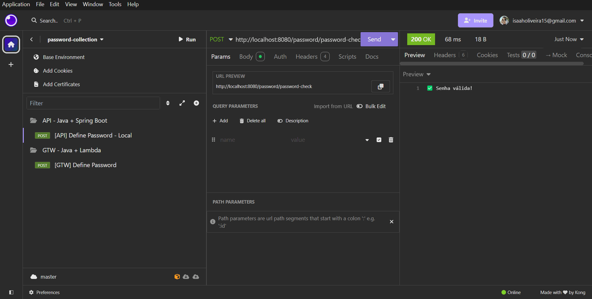
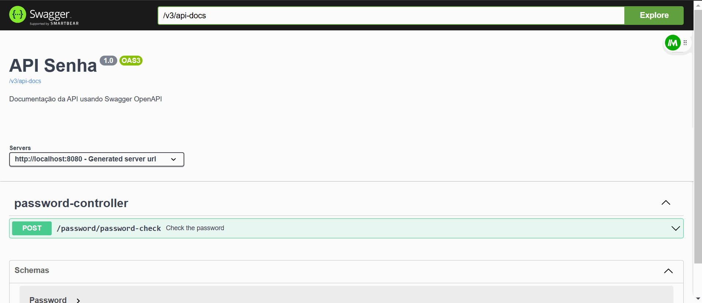
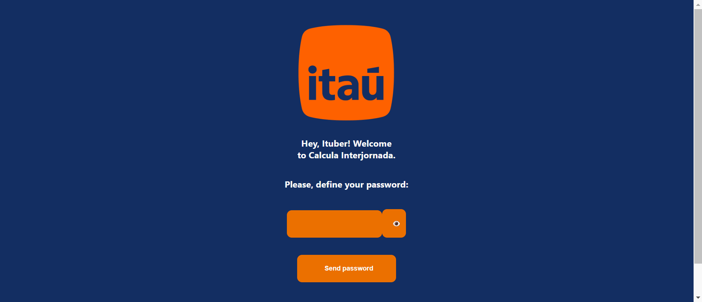

# API Senha - Java + Spring Boot 

- Versão: 1.0

## Descrição: 

Esta API tem como objetivo verificar a validade de senhas, garantindo que elas atendam a certos critérios de segurança, como ter caracteres maiúsculos, minúsculos, caracteres especiais e sem caracteres repetidos.

Formas de visualizar/testar a API: 

### Via Insomnia 






**1. Endpoints da API**

[POST /password/password-check]

Verifica a validade de uma senha fornecida.

### Descrição:
Este endpoint recebe uma senha e verifica se ela atende aos requisitos de segurança:

- Pelo menos uma letra maiúscula.
- Pelo menos uma letra minúscula.
- Pelo menos um caractere especial (!@#$%^&*()).
- Pelo menos 9 caracteres.
- Não pode conter caracteres repetidos.

Parâmetros de Request:

Body:

```plaintext
{
    "password": "senha123!"
}
```

Respostas:

200 OK (Quando a senha for válida):

```plaintext
{
    "message": "✅ Senha válida!"
}
```

400 Bad Request (Quando a senha não for válida):

- Se a senha estiver vazia:

```plaintext
{
    "message": "❌ Password should not be empty."
}
```

- Se a senha não contiver ao menos uma letra maiúscula:

```plaintext
{
    "message": "❌ Password should have at least one uppercase letter."
}
```

- Se a senha não contiver ao menos uma letra minúscula:

```plaintext
{
    "message": "❌ Password should have at least one lowercase letter."
}
```

- Se a senha não contiver ao menos um caractere especial:

```plaintext
{
    "message": "❌ Password should have at least one special character (!@#$%^&*()-+)."
}
```

- Se a senha tiver menos de 9 caracteres:

```plaintext
{
    "message": "❌ Password should have at least 9 characters."
}
```

- Se a senha contiver caracteres repetidos:

```plaintext
{
    "message": "❌ Password should not contain repeated characters."
}
```

2. Configurações e Middlewares

### CORS Configuration

A configuração de CORS permite que requisições de origens específicas possam acessar os recursos da API.

- Origem permitida: http://localhost:3000
- Métodos permitidos: GET, POST, PUT, DELETE
- Cabeçalhos permitidos: Todos (*)
- Credenciais permitidas: true

### Swagger OpenAPI
A documentação da API é gerada automaticamente através do Swagger (OpenAPI). Isso permite uma visualização e interação fácil com os endpoints, conforme definido no arquivo SwaggerConfig.

3. Tratamento de Exceções
A API usa uma classe de exceções personalizada para tratar erros que ocorrem durante a validação da senha. Se um erro ocorrer, ele é tratado com a resposta adequada.

### Exceções Possíveis:
- NotEmptyException: A senha não pode estar vazia.
- HasUpperException: A senha precisa ter pelo menos uma letra maiúscula.
- HasLowerException: A senha precisa ter pelo menos uma letra minúscula.
- HasSpecialCharacterException: A senha precisa ter pelo menos um caractere especial.
- MinimunCharactersException: A senha precisa ter pelo menos 9 caracteres.
- RepeatedCharacterException: A senha não pode ter caracteres repetidos.
- Formato de resposta para erro:
- Cada exceção retorna uma mensagem de erro no formato:

```plaintext
{
    "message": "❌ <mensagem de erro>"
}
```

4. Dependências
- Spring Boot: Framework utilizado para criar a API.
- Swagger (OpenAPI): Usado para gerar e documentar os endpoints da API.
- Spring Web: Para gerenciar as requisições HTTP.
- Spring Context: Para injeção de dependências e configuração.

5. Como Rodar o Projeto

a) Clone o repositório do projeto.
b) Abra o projeto em sua IDE preferida (ex: IntelliJ, Eclipse).
c) Execute o projeto com o comando: mvn spring-boot:run
d) A API estará disponível em http://localhost:8080.
e) Acesse a documentação da API em http://localhost:8080/swagger-ui/index.html.